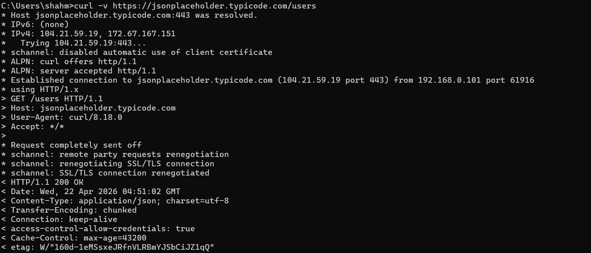

"phase0" 
### P0.1 Command line + Git
- **Goal:** navigate a Unix shell, use Git day-to-day, understand branches, merges, rebases, PRs.

- **How InfraSight uses it:** every task happens on a feature branch following `<author>/<type>/<description>`, targeting the integration branch via merge requests on a private GitLab server.
- **Success check:** initialize a personal repo on GitLab or GitHub, create a branch, commit, push, open a merge request, have a friend review it

    ## What i done so far:

    - navigate unix shell
    - created a git repository
    - git add .
    - git commit -m "initial commit"
    - created main branch and push to github 
    - created a feature branch rad/feature/add-readme-update
    - push feature branch to github and open a PR

### P0.2 HTTP, REST, JSON

- **Goal:** know status codes, methods, headers, cookies, CORS at a conceptual level. Read and write JSON.
- **Resources:** MDN *HTTP overview*, MDN *Using HTTP cookies*, MDN *CORS*.

    ## What i done so far:

    - Explored MDN resources and learned about http, cors, status code , cookies , session.
    - curl -v https://jsonplaceholder.typicode.com/users
    
    - explained each line of request and response

